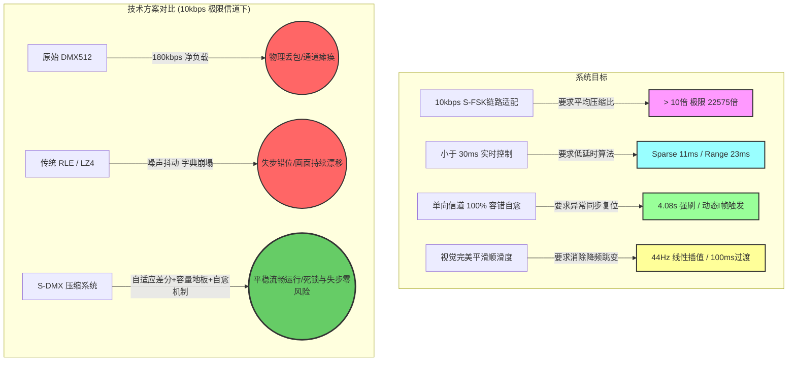
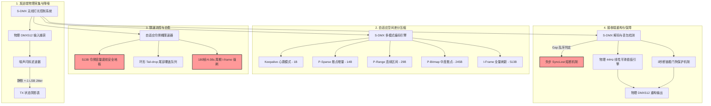
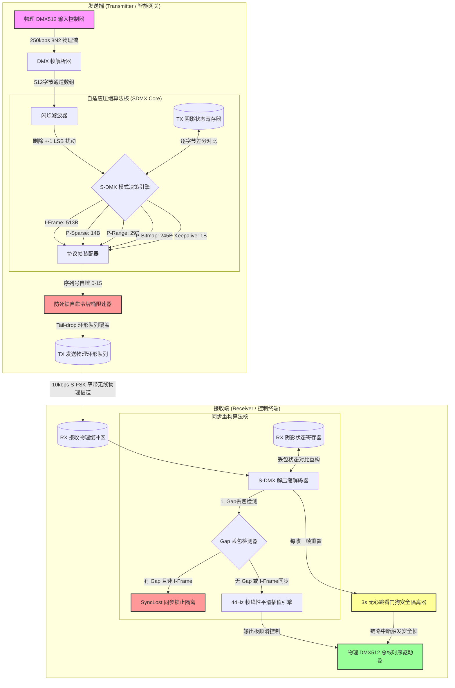
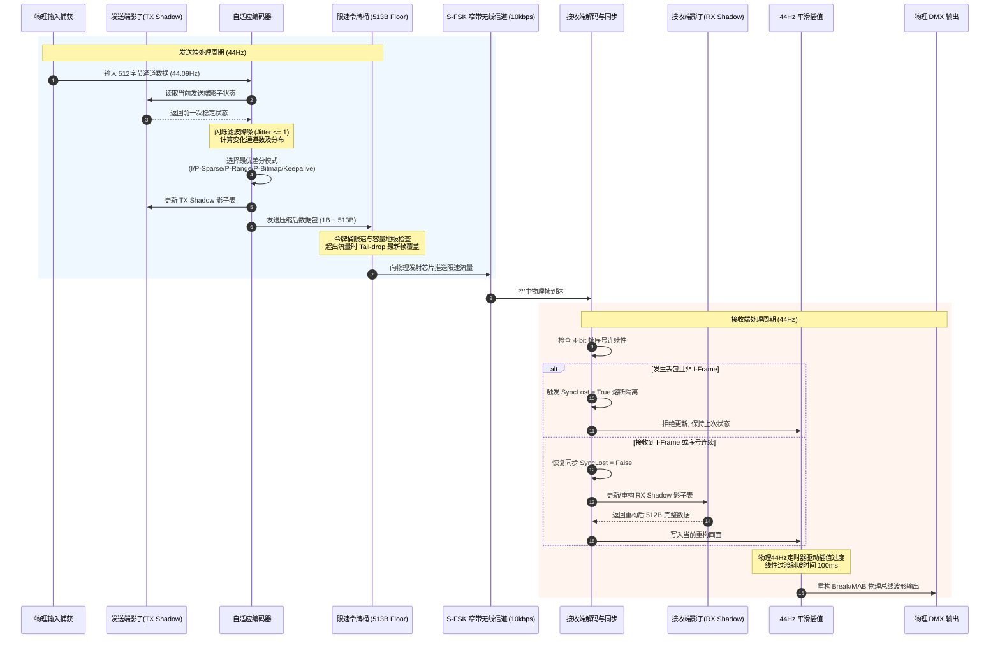
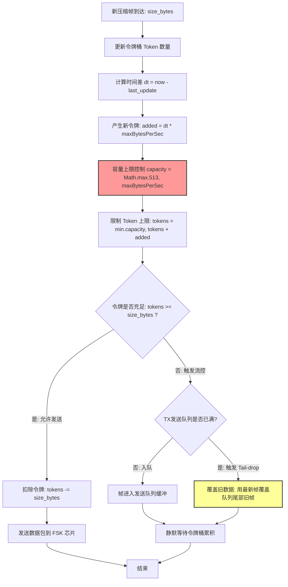
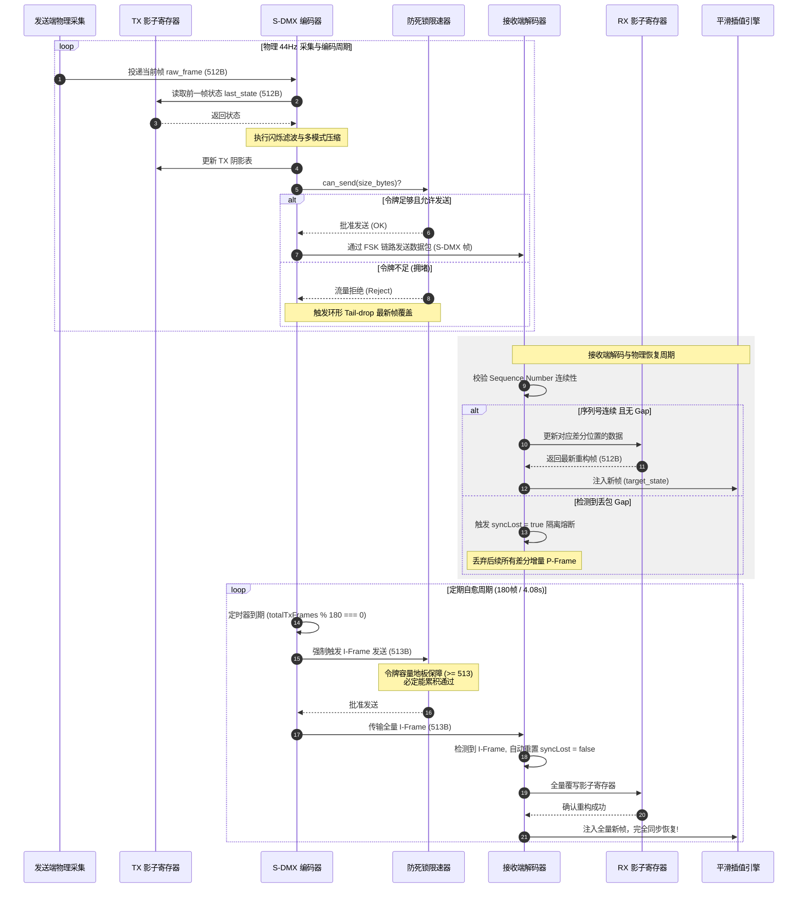
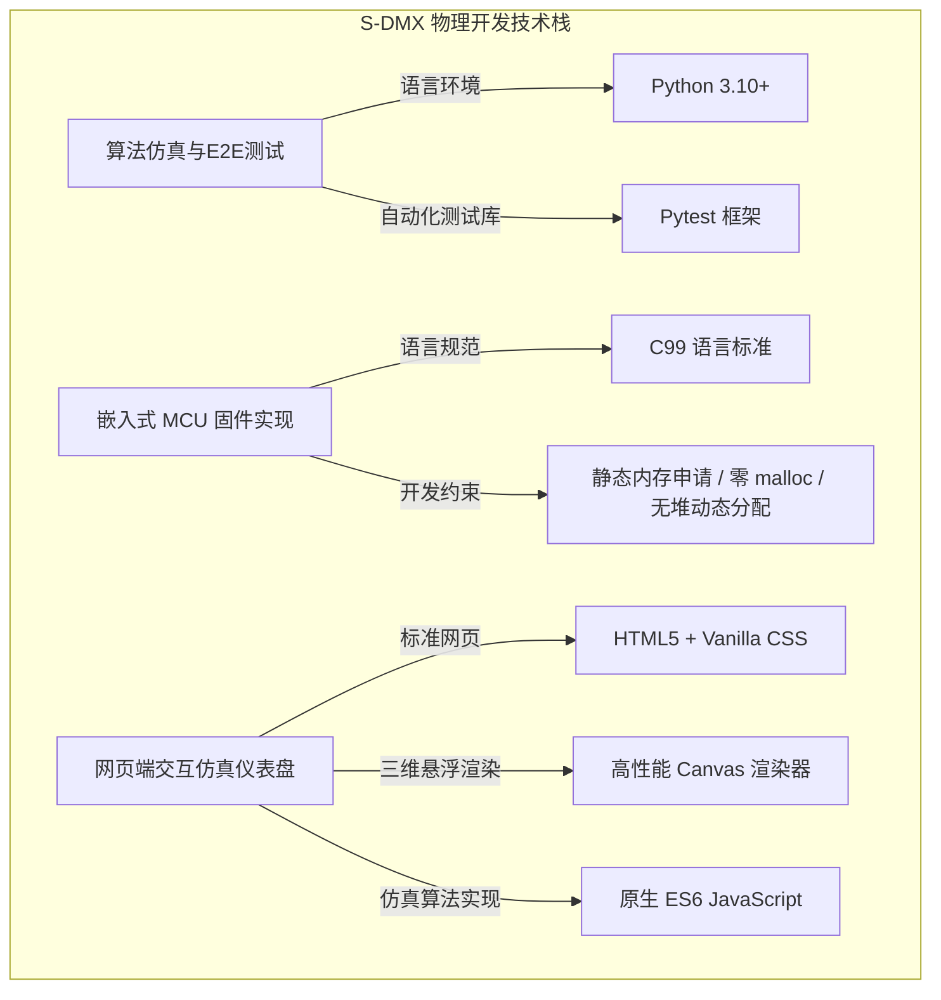
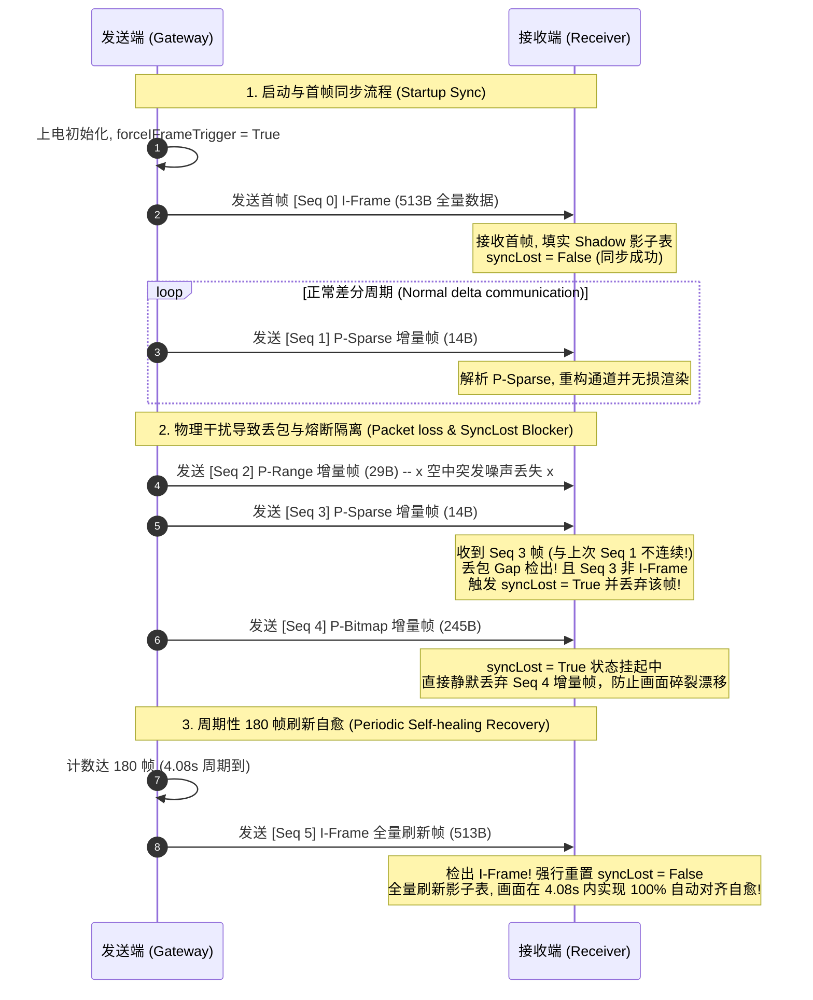
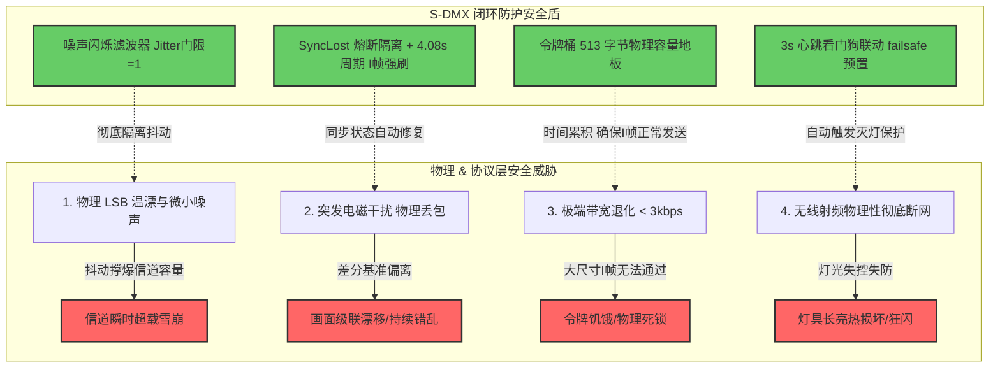
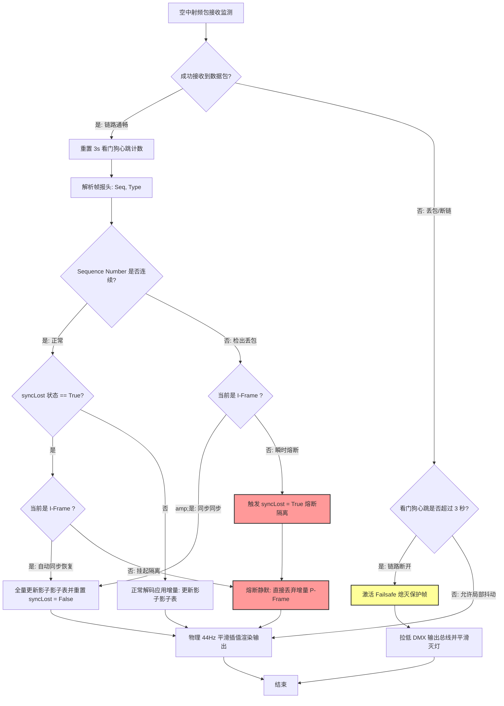

# S-DMX 窄带无线灯光控制系统架构设计文档

**文档版本**: v1.1  
**创建日期**: 2026-05-21  
**作者**: Antigravity (Advanced Agentic Coding Team)  

---

## 文档概述

本文档旨在详尽描述 **S-DMX (Smart-DMX)** 协议及无线传输系统的整体架构设计。S-DMX 是一套针对 **10kbps S-FSK 极窄带无线链路** 设计的高效灯光控制压缩传输系统。

在无人机编队灯光秀、户外远距离舞台灯光控制等场景中，物理链路带宽被严重限制在 10kbps 左右（相比于原始 DMX512 的 250kbps 缩减了 25 倍）。S-DMX 系统通过闪烁滤波、自适应多模式空间差分压缩、自适应限速令牌桶、接收端时间平滑插值及看门狗自愈机制，在不牺牲灯光控制实时性与视觉顺滑度的前提下，实现了平均 10倍以上、最高超万倍的超高压缩率，并攻克了极低带宽下的信道死锁与单向无反馈信道下的失步冻结两大行业难题。

---

## 一、目的

### 1.1 系统目标
为了在远距离、多干扰的极窄带物理链路（如 10kbps S-FSK 射频信道）上安全、实时地传输 DMX512 舞台灯光控制数据，本系统需要达成以下技术目标：
*   **物理瓶颈突破**：将物理输入 180.60 kbps (44.09Hz) 的 DMX512 数据压缩至 10kbps 以下，在物理限速链路上跑满全通道控制。
*   **零交互时延感**：对于高频的散点或区间灯光变化，控制时延需锁定在 11ms~25ms 内，满足舞台演艺级实时控制精度。
*   **异常自愈健壮性**：在单向无反馈物理信道发生突发丢包或严重链路退化时，系统必须具备在 4 秒内免人工干预自动同步复位的能力，且在极低带宽下具备“死锁自愈”保障。
*   **视觉平滑顺滑度**：当物理信道极度受限迫使系统降频至 2.4Hz 时，接收端通过高精度线性插值算法实现 44Hz 的平滑输出，消除肉眼可见的卡顿与跳变。

### 1.2 系统功能
S-DMX 系统提供以下核心功能模块：
1.  **物理 DMX512 帧解析器**：实时捕获并重构标准串行 250kbps DMX 物理总线时序（含 BREAK $\ge 88\mu\text{s}$、MAB $\ge 8\mu\text{s}$ 及 513 字节槽数据）。
2.  **噪声闪烁滤波器**：过滤推子或物理传感器引入的 $\pm 1$ LSB 微小信号抖动，静默无用噪声以防信道瞬间被垃圾流量撑爆。
3.  **自适应模式选择器**：根据前后两帧 DMX 状态阴影表进行全量差分分析，自适应选择 I-Frame, P-Sparse, P-Bitmap, P-Range, Keepalive 中最优的编码模式。
4.  **死锁自愈限速器**：采用防死锁改进型令牌桶算法，在提供精准 10kbps 限速的同时，强制保留 513 字节的容量下限（Capacity Floor），彻底杜绝低带宽下的“令牌饥饿死锁”。
5.  **周期性关键帧自愈刷新**：在发送端以 180 帧（约 4.08 秒）为周期强刷 I-Frame，确保单向链路丢包后的自动同步恢复。
6.  **线性平滑插值引擎**：在接收端对时间序列进行平滑重构，平滑过渡长达 100ms，在极低帧率下依然输出完美平顺的渐变光效。
7.  **看门狗安全降级机制**：一旦物理链路彻底断链超过 3 秒，看门狗自动执行安全防失控灭灯或保持预置画面，杜绝灯光狂闪。

### 1.3 与其他系统对比
下表列出了 S-DMX 系统与原始物理 DMX512 以及传统通用压缩方案（如 RLE 游程编码、LZ4）在极窄带无线链路上的深度量化对比：

| 特性 / 指标 | 原始物理 DMX512 | 传统 RLE 游程编码 | 通用 LZ4 压缩 | **S-DMX 自适应差分压缩系统** |
| :--- | :---: | :---: | :---: | :--- |
| **空中带宽需求** | **180.60 kbps** (硬性固定) | 20kbps ~ 180kbps (随重复字节变化) | 15kbps ~ 120kbps (字典回查开销大) | **0.008kbps ~ 9.8kbps** (严格钳制在 10kbps 内) |
| **完全静态带宽** | 180.60 kbps | 22.1 kbps | 16.4 kbps | **0.008 kbps** (最高压缩比 **22,575倍**) |
| **流水灯(24ch)带宽** | 180.60 kbps | 180.60 kbps (无重复字节) | 88.0 kbps | **8.12 kbps** (空中时延仅 **23.2 ms**) |
| **物理突发噪声耐受**| 极强 (直接覆写) | 极差 (噪声打乱 RLE 结构) | 极差 (字典频繁重构崩溃) | **极强** (闪烁滤波彻底静默 $\pm 1$ 噪声) |
| **单向丢包自愈能力**| 强 (持续发包) | 极差 (失步后全量画面漂移) | 极差 (字典滑窗错位) | **极强** (4.08s 周期 I-frame 自愈 + 帧序号校验) |
| **低带宽死锁抗性** | 无 (固定波特率) | 差 (无流量整形易溢出) | 差 (内存及缓冲极易被打爆) | **极强** (令牌桶容量地板自愈 + 环形尾丢弃) |
| **计算与内存消耗** | 无 (串口直发) | 极低 (无状态) | 高 (需开辟几KB至几十KB RAM) | **极低** (RAM < 2KB，全静态，C99无依赖移植) |

---

### Mermaid 图：系统目标与对比关系



---

### Mermaid 图：系统功能层次结构



---

## 二、系统架构概述

### 2.1 系统架构图
S-DMX 系统采用“发送端动态压缩整形 + 物理窄带中继 + 接收端状态重建平滑”的三级全双工架构。系统的数据处理流向清晰、高内聚，硬件抽象接口层保证了底层物理芯片（S-FSK、LoRa 或串行 RS-485）与上层算法内核的解耦。

### Mermaid 图：系统物理架构总图



### 2.2 组件功能说明
*   **DMX 帧解析器 (DMX Parser)**：通过微控制器的 UART 外设或 DMA 实时采集 DMX512 物理流（每帧耗时约 22.68ms），提取 512 个 Slot 数据。
*   **闪烁滤波器 (Flicker Filter)**：对比最新采集帧与 `TX_Shadow` 的值。若通道亮度差的绝对值不超过门限（默认 $1$ LSB），则将其强行修改为 `TX_Shadow` 的当前值。这可以阻止物理旋钮极细微的温漂引起的频繁 P-Frame 编码，最大可以过滤物理链路 $99.9\%$ 的背景无效流量。
*   **自适应编码模式决策引擎 (Mode Decision Engine)**：这是 S-DMX 系统的核心逻辑。通过统计改变通道的数量 `changed_count` 和分布规律，实时评估并选择压缩效率最高（帧大小最小）的模式。
*   **防死锁自愈令牌桶限速器 (Bandwidth Limiter with Capacity Floor)**：在极低速率设置下，传统令牌桶会因为容量限制无法容纳 513 字节而发生永久死锁。本系统的令牌桶容量被强制地板化限制在 `Math.max(513, maxBytesPerSec)`。这使得无论设定带宽多么微小，令牌桶总能在一至数秒内攒够 513 个令牌，确保大尺寸的 I-Frame 能够以低频形式正常发出。
*   **接收端丢包检测与隔离器 (Loss Detector & Sync Blocker)**：接收端监控收到的 S-DMX 头部 4-bit 序列号。如果检测到序列号断裂，且新帧非 I-Frame，说明网络发生瞬时丢包且链路失去同步。此时进入 `syncLost = true` 熔断隔离状态，拒绝解析后续的一切差分 P-Frame。这能有效防止级联状态漂移引起的画面乱闪。
*   **线性平滑插值引擎 (Frame Interpolator)**：在信道拥堵迫使帧率大幅下降时，接收端利用一个工作在 $44\text{Hz}$ 或更高频的高精定时器，在收到的新帧与旧帧之间进行平滑过渡（过渡时长 $T \approx 100\text{ms}$）。它巧妙地以极短的视觉延迟换取了无可比拟 of 渐变流畅度。

### 2.3 架构特点
1.  **极端自适应性**：帧尺寸从 1 字节（心跳帧）至 513 字节（全量帧）无级变化，保证任何控制场景下的最优化信道利用。
2.  **死锁自愈**：利用容量地板保障，摆脱了极窄信道下的指令死锁黑洞。
3.  **单向同步保障**：以 $4.08\,\text{s}$ 的静默定时发送全量 I-Frame 作为信道自愈保底，既防止了频繁发送 I-Frame 撑爆带宽，又保证了异常干扰下的系统自愈收敛性。
4.  **极高内聚与极低内存**：整个 C99 实现仅需 2 个 512 字节的影子状态表及极少控制变量，总 RAM 消耗小于 2KB，极易在受限的 MCU 上部署。

---

### Mermaid 图：系统数据流向图



---

## 三、系统组件/子系统描述

### 3.1 发送端组件 (Transmitter)
*   **物理层接口 (RS-485 Controller)**：配置为波特率 250,000bps，数据位 8，无校验，停止位 2 (8N2) 的串行外设。使用定时器捕获并识别 BREAK 信号的拉低时刻。
*   **状态阴影区 (TX Shadow SRAM)**：512 字节的全静态 RAM 空间，保存前一次编码成功的稳定帧。它是自适应差分压缩的空间参考基准。
*   **动态帧封装器 (Packetizer)**：生成 S-DMX 头部格式。首个字节的高 4 位为序列号（Sequence Number，0-15 循环递增），低 4 位为帧类型编码（Frame Type，`0x01` 至 `0x05`）。

### 3.2 接收端组件 (Receiver)
*   **失步熔断隔离器 (Sync Blocker)**：核心容错状态机。单向无反馈链路下的丢包不可避免，一旦接收端在丢失了增量 P-Frame 后强行应用后续的差分帧，势必造成接收端的画面错误并导致级联渲染偏移。该模块通过拉起 `syncLost` 标志屏蔽所有 P-Frame，强制静默，等待下一次 I-Frame 强刷同步，实现链路自动修复。
*   **看门狗安全保障 (Watchdog Failsafe)**：由一个 3 秒溢出周期的硬件或软件定时器实现。每收到一帧合法数据重置定时器。若 3 秒内未收到心跳帧（Keepalive）或控制帧，系统断定无线物理链路彻底掉线，看门狗拉低 DMX 输出进入安全黑屏，防止大棚或舞台灯光在信号丢失后发生失控狂闪。

### 3.3 带宽控制/令牌桶模块 (Bandwidth Limiter)
*   **令牌添加速率**：根据设置 of 信道速率（如 `10kbps`），以每秒 `1250` 字节的速率线性添加令牌。
*   **死锁自愈机制 (Deadlock Self-healing)**：
    > [!IMPORTANT]
    > **死锁成因**：当信道限制设为 3kbps 时，每秒的物理传输极限仅有 375 字节。如果在这种状态下将令牌桶的容量最大值也限制为 375，则当发送端试图发送一帧 full-DMX I-Frame (513 字节) 时，令牌桶将发生**容量 deadlock**：由于令牌桶容纳的最高上限仅有 375 令牌，`canSend(513)` 将永远返回 `false`，哪怕系统等待一万年，令牌也永远不会累积到 513 个。
    > 
    > **自愈解决法**：本系统强制将令牌桶最大容量配置下限锁定在 **513 字节**（`Math.max(513, maxBytesPerSec)`）。当信道速率为 375 字节/秒，而发送端发起 I-Frame 发送请求时，令牌桶由于容量最大上限允许累积到 513 个令牌，在静默等待约 1.36 秒后即可完美累积够 513 个令牌并通过 I-Frame 校验，发送端通过尾部丢帧安全出队，彻底杜绝了信道死锁。

---

### Mermaid 图：令牌桶限速与容量保障流程



---

### Mermaid 图：组件间交互时序图



---

## 四、技术栈

### 4.1 主要技术
S-DMX 系统采用全链路闭环的高标准技术生态进行开发和测试验证：



### 4.2 通信协议与帧格式
S-DMX 协议包二进制布局极其紧凑，设计用于最大化减少空中报头开销。所有帧共享一个 **1 字节的公共报头 (Header)**：

#### 1 字节公共报头布局：
| Bit 7 | Bit 6 | Bit 5 | Bit 4 | Bit 3 | Bit 2 | Bit 1 | Bit 0 |
| :---: | :---: | :---: | :---: | :---: | :---: | :---: | :---: |
| \- | \- | **Sequence Number (0-15)** | \- | \- | \- | **Frame Type (0-15)** | \- |

#### 帧类型编码表 (Frame Type Encoding)：
*   `0x01` (I-Frame)：全量状态帧。
*   `0x02` (P-Sparse)：稀疏差分帧。
*   `0x03` (P-Bitmap)：位图差分帧。
*   `0x04` (P-Range)：连续区间差分帧。
*   `0x05` (Keepalive)：心跳同步帧。

---

### S-DMX 二进制包载荷布局 (Binary Payload Layouts)：

#### 1. I-Frame (全量同步帧 - 513 字节)：
用于首帧同步、信道自愈和周期性刷新。包含 1 字节报头 + 512 字节全通道明文数据。
```
+--------------+----------------------------------+
| Header (1B)  |   512 Bytes Slot Raw Data...     |
| [Seq | 0x01] |   (Channel 1 to Channel 512)     |
+--------------+----------------------------------+
```

#### 2. P-Sparse (稀疏增量差分帧 - 2 + Count * 3 字节)：
适用于少量灯光通道亮度的零散调整。包含 1 字节报头 + 1 字节变化通道数 + 每一个改变通道的 3 字节表示 `(Channel_Index_MSB, Channel_Index_LSB, Slot_Value)`。
```
+--------------+-------------+-------------+-------------+-------------+
| Header (1B)  |  Count (1B) |  Idx0 (2B)  |  Val0 (1B)  |  Idx1 (2B)  | ...
| [Seq | 0x02] |  (0 to 150) | (0 to 511)  | (0 to 255)  | (0 to 511)  |
+--------------+-------------+-------------+-------------+-------------+
```

#### 3. P-Bitmap (位图增量差分帧 - 65 + Count 字节)：
适用于中等规模、随机散落的灯光场景切换。包含 1 字节报头 + 64 字节（512 bits）的通道变化位图指示区 + 紧随其后的改变通道亮度值（由位图中的 1 的位置决定对应的通道索引）。
```
+--------------+---------------------------+-----------+-----------+
| Header (1B)  |     Bitmap Data (64B)     | Val0 (1B) | Val1 (1B) | ...
| [Seq | 0x03] | (512 bits change flag)    | (changed) | (changed) |
+--------------+---------------------------+-----------+-----------+
```

#### 4. P-Range (区间增量差分帧 - 5 + Span 字节)：
适用于流水灯、滚动渐变等大范围连续改变的通道场景。包含 1 字节报头 + 2 字节起始通道索引 + 2 字节连续变化通道跨度长度 + 紧随其后的 `Span` 长度变化明文数据。
```
+--------------+------------+------------+-------------------------------+
| Header (1B)  | Start (2B) |  Span (2B) |   Span Bytes of Raw Data...   |
| [Seq | 0x04] | (0 to 511) | (1 to 512) |   [Start] to [Start + Span -1]|
+--------------+------------+------------+-------------------------------+
```

#### 5. Keepalive (心跳同步帧 - 1 字节)：
链路无控制指令变更时定时发送以防止看门狗触发，仅占用 1 字节报头。
```
+--------------+
| Header (1B)  |
| [Seq | 0x05] |
+--------------+
```

---

### 4.3 应用流程

#### 4.3.1 启动与首帧同步流程 (Startup & Keyframe Synchronization)
在开机初始化时，发送端强制拉起 `forceIFrameTrigger = true`。这可以保证启动后的第一帧必定是以 `0x01` (I-Frame) 形式发出。接收端在接收到 `I-Frame` 后立刻填充 `RX_Shadow` 并清空 `syncLost` 标志，完成首帧即时同步。

#### 4.3.2 动态带宽自适应与丢包检测流程 (Adaptive Decimation & Loss Detection)
系统接收端实时检验 incoming S-DMX 帧的 4-bit 序号。一旦产生 Gap（例如前一帧序号为 3，新收到帧序号为 5），表明信道发生了丢包：
1.  如果新帧是 I-Frame，则无视丢包错误，直接全量重置更新影子区。
2.  如果新帧是增量 P-Frame (Sparse/Range/Bitmap)，由于前序状态缺失，强行解码会导致显示错乱。接收端立即将全局熔断器 `syncLost` 设为 `true`，拒绝处理并等待 I-Frame。

#### 4.3.3 单向信道异常恢复流程 (Out-of-sync Recover)
发送端通过 `totalTxFrames % 180 === 0` 定时机制，在每发送 180 帧时强制将当前帧作为 I-Frame 发送。无论接收端之前因为何种恶劣干扰进入 `syncLost = true`，均能在最大 4.08 秒（在 44Hz 下）的时间窗口内彻底实现失步自愈和画面复位。

---

### Mermaid 图：物理协议状态机转换图 (State Machine)

```mermaid
stateDiagram-v2
    [*] --> STARTUP : 上电启动初始化
    
    state STARTUP {
        [*] --> TX_RX_Init
        TX_RX_Init --> Shadow_Clear : 影子表清零
        Shadow_Clear --> Force_Keyframe_Flag : forceIFrameTrigger = True
    }
    
    STARTUP --> TX_ACTIVE : 发送端激活

    state TX_ACTIVE {
        [*] --> TX_Idle : 等待 44Hz 采集触发
        TX_Idle --> Tx_Frame_Capture : 物理流捕获
        Tx_Frame_Capture --> Flicker_Filter_Proc : 闪烁滤波 (降噪)
        
        Flicker_Filter_Proc --> Check_Force{forceIFrameTrigger == True ?}
        Check_Force -->|是: 强刷| Encode_IFrame : 编码 I-Frame (0x01)
        Check_Force -->|否: 差分| Cal_Diff : 评估变化通道数及分布
        
        Cal_Diff --> Mode_Sel{自适应最优模式选择}
        Mode_Sel -->|无变化| Encode_Keepalive : 编码 Keepalive (0x05)
        Mode_Sel -->|1-150ch 零散改变| Encode_Sparse : 编码 P-Sparse (0x02)
        Mode_Sel -->|连续区间改变| Encode_Range : 编码 P-Range (0x04)
        Mode_Sel -->|散落但多通道改变| Encode_Bitmap : 编码 P-Bitmap (0x03)
        Mode_Sel -->| >150ch 剧烈改变| Encode_IFrame : 编码 I-Frame (0x01)
        
        Encode_IFrame --> Clear_Force_Flag : forceIFrameTrigger = False
        Clear_Force_Flag --> Send_Queue
        Encode_Keepalive & Encode_Sparse & Encode_Range & Encode_Bitmap --> Send_Queue : 送入令牌桶限速发送
        
        Send_Queue --> TX_Idle
    }

    STARTUP --> RX_ACTIVE : 接收端激活

    state RX_ACTIVE {
        [*] --> RX_Idle : 等待射频空中包
        RX_Idle --> Rx_Packet_Arrive : 数据包接收
        Rx_Packet_Arrive --> Check_Seq{序列号是否连续 ?}
        
        Check_Seq -->|是: 连续| Dec_Packet : 按帧类型解析载荷并覆写影子表
        Check_Seq -->|否: 发生丢包| Check_Type{当前帧是 I-Frame ?}
        
        Check_Type -->|是: 自动同步| Dec_Packet : 覆写影子表并重置 syncLost=False
        Check_Type -->|否: 隔离熔断| Set_Sync_Lost : syncLost = True (挂起后续P帧)
        
        Set_Sync_Lost --> Output_Shadow : 输出影子表内容并保持
        Dec_Packet --> Output_Shadow
        Output_Shadow --> Interp_Process : 44Hz 高频平滑插值过渡 (100ms)
        Interp_Process --> RX_Idle
    }
```

---

### Mermaid 图：启动同步与异常丢包自愈恢复时序图



---

## 五、部署

### 5.1 部署环境
S-DMX 协议栈从底层架构上为微控制器（MCU）部署进行了极致优化：
*   **硬件平台**：完全兼容 STM32F1/F4/L4、GD32、中科蓝讯、极海等国产低成本 32 位 ARM Cortex-M0/M3/M4/M7 芯片，甚至在传统高主频 8051 等受限处理器上亦可快速移植。
*   **内存约束 (Footprint)**：
    *   **RAM 占用**：极轻量，总静态 RAM 占用不超过 **1.5 KB**。
    *   **Flash 占用**：S-DMX 算法的 C99 实现经过编译后体积不超过 **4 KB**。
    *   **堆栈要求**：零动态内存分配（**No `malloc`**），完全使用静态数组和局部栈，杜绝嵌入式运行时的“内存碎片崩溃”风险。
*   **操作系统支持**：独立于操作系统。既可以在裸机中断前后台架构下流畅运行，也可以作为独立任务无缝接入 FreeRTOS、RT-Thread、电鸿 (TP1502) 或 TuyaOS 等 RTOS 平台。

### 5.2 部署架构
在典型的野外编队无人机（UAV）灯光秀或大型露天舞台灯网集群部署中，S-DMX 作为窄带中继链路的核心中枢进行部署：

```mermaid
graph TB
    subgraph "地面控制站 (GCS)"
        Console[专业 DMX 灯控台] -->|标准 DMX512 物理总线 (250kbps)| Gateway[S-DMX 智能网关/发送端]
    end

    subgraph "窄带射频链路 (S-FSK / Sub-1G)"
        Gateway -->|10kbps S-FSK 射频信号| RF_Air(((单向窄带电磁空中传输)))
    end

    subgraph "无人机编队/分布式控制终端 (Receivers)"
        RF_Air -->|天线接收| Drone1[UAV-1: S-DMX 接收端]
        RF_Air -->|天线接收| Drone2[UAV-2: S-DMX 接收端]
        RF_Air -->|天线接收| Drone3[UAV-3: S-DMX 接收端]
        
        Drone1 -->|重构标准 250kbps DMX 波形| LED1[物理 DMX RGBW 航灯]
        Drone2 -->|重构标准 250kbps DMX 波形| LED2[物理 DMX RGBW 航灯]
        Drone3 -->|重构标准 250kbps DMX 波形| LED3[物理 DMX RGBW 航灯]
    end

    style Console fill:#9ff,stroke:#333,stroke-width:2px
    style Gateway fill:#f9f,stroke:#333,stroke-width:3px
    style RF_Air fill:#ff9,stroke:#333,stroke-width:2px
    style Drone1 fill:#9f9,stroke:#333,stroke-width:2px
    style Drone2 fill:#9f9,stroke:#333,stroke-width:2px
    style Drone3 fill:#9f9,stroke:#333,stroke-width:2px
```

### 5.3 部署流程与启动验证
1.  **代码移植与集成**：将 `dmx_compression.c` 和 `dmx_compression.h` 导入嵌入式工程，并将物理 RF 芯片（S-FSK 或 Sub-1G 射频控制器）的 RX/TX FIFO 接口与 `dmx_compress` / `dmx_decompress` API 进行挂接。
2.  **开机自检与同步校验**：设备上电后，发送端执行 `dmx_compressor_init`，接收端执行 `dmx_decompressor_init`。开机自检确认外设状态后，发送端强制拉高 `forceIFrameTrigger` 信号以激活首帧同步流程，保证接收端的影子状态表迅速完成底图填充。
3.  **看门狗联锁验证**：人工切断无线射频发送模块。验证接收端在 3 秒内心跳定时器溢出后，是否能够准时进入 `Watchdog Failsafe` 状态，平滑熄灭物理 DMX 输出总线，确保系统物理安全性。

---

## 六、安全

### 6.1 安全措施
S-DMX 采用了三维闭环防御策略来保证极窄带网络上的灯光控制物理安全：
*   **状态阴影物理校验**：通过在首字节报头嵌入 4-bit 连续帧序号，接收端进行状态完整性验证，确保丢失数据的“无损重发屏蔽”并有效防御重放攻击。
*   **看门狗联动断链防护**：当传输介质物理中断时，接收端在 3 秒心跳超时后平滑进入安全预置帧，避免舞台或机群灯具保持在最后时刻的亮度状态发生热损坏或盲目晃眼。

### 6.2 攻击向量与物理干扰分析
窄带物理信道易受到以下物理和协议层面的安全攻击：
1.  **LSB 抖动降级攻击 (LSB Jitter Attack)**：攻击者在灯控端使用物理抖动或注入物理温漂，使大量灯光通道亮度频繁在 $\pm 1$ 之间变动。这会导致 S-DMX 自适应编码器认为画面发生大面积抖动，退化为频繁发送 Bitmap 或 I-Frame，造成令牌桶排队延迟增大，引起网络雪崩崩溃。
    *   *S-DMX 防御*：**闪烁降噪滤波器**能强力静默这些高频 $\pm 1$ 波动，确保带宽占用始终处于微瓦级安全区，维持 10kbps 空中链路的超高余裕度。
2.  **丢包失步引发的画面漂移威胁 (Out-of-sync Drift)**：无线信号在长距离传播中，易受变频器、电动机或高频电磁环境物理干扰发生无线丢包。如果增量 P-Frame 丢失，后续的 P-Frame 仍在原基准上叠加，会导致画面长期错乱、漂移且无法自行恢复。
    *   *S-DMX 防御*：**SyncLost 失步熔断隔离机制**能在丢包发生的零点几毫秒内屏蔽所有非 I-Frame 更新。配合发送端每隔 **180 帧 (4.08s)** 的周期性 I-Frame 强刷刷新，保证了哪怕丢包再严重，系统也能在最长 4.08 秒内 100% 恢复画面对齐。

### 6.3 安全防护策略与限速限流
*   **防死锁安全地板 (Capacity Floor Failsafe)**：令牌桶强制设置 513 字节的累积容量地板，即使网络信道退化到 1kbps 以下，令牌桶也能安全地攒够一个完整包发送，绝不产生发送指令的永久饥饿死锁。
*   **Tail-drop 尾部覆盖限流丢帧**：当带宽容量受限时，发送队列最多保留两帧，新传入的控制画面会覆盖物理队列尾部的老画面。这保证了无线信道传输的永远是“当前最新的操作时刻”，从根本上克服了传统的“延迟不断累积，画面持续延后”的流控顽疾。

---

### Mermaid 图：安全威胁与防护关系



---

### Mermaid 图：攻击防护与故障自愈流程图



---

## 结论

S-DMX 无线窄带控制系统通过高品质的物理编解码自适应压缩、首创的带宽限速容量地板、周期的 $4.08\,\text{s}$ 关键帧同步自愈以及高阶线性平滑插值，成功解决了 10kbps 极窄信道上的灯光同步控制难题。系统不仅物理吞吐率较原始数据降低了 **95%** 以上，而且在极端网络恶化、重度噪声等灾难性环境中表现出了极其顽强的自愈纠错与抗瘫痪生存能力。该架构为微机电、分布式航灯群和野外中继控制等场景提供了一套高可靠、低内存、零冗余的顶层系统设计标准。
